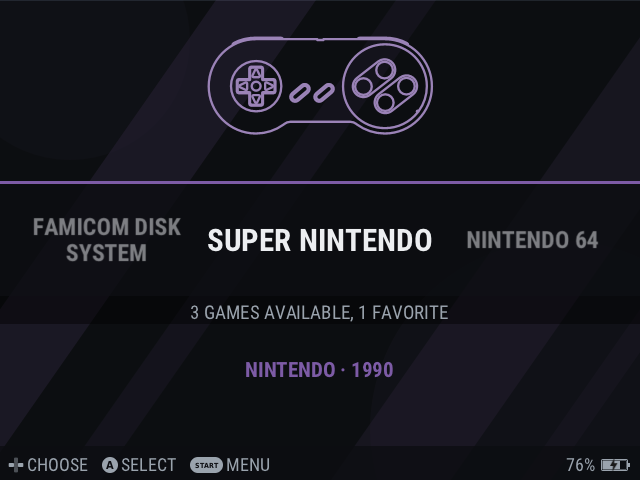
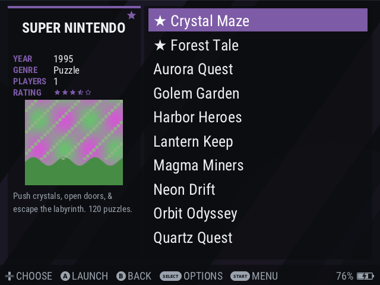
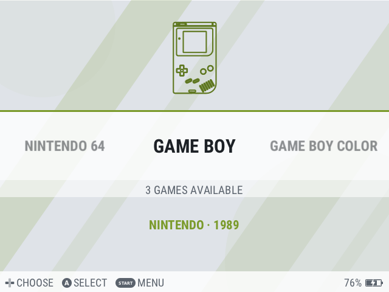
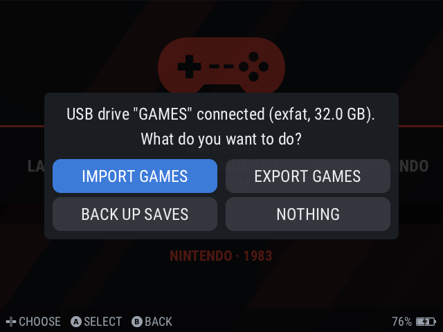
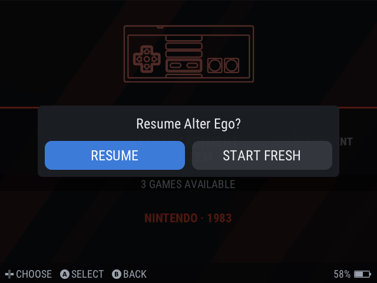
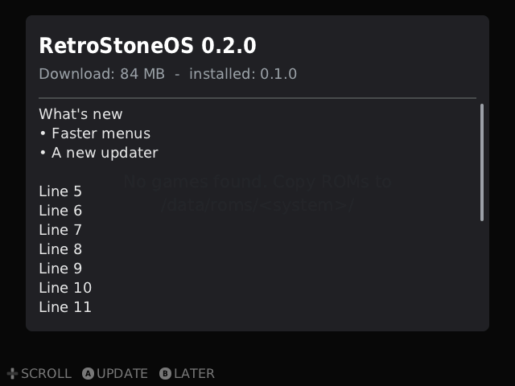

# RetroStoneOS

**A fast, minimal retro-gaming OS for the RetroStone2 handheld, and for Raspberry Pi and Orange Pi boards.**

RetroStoneOS boots straight into an EmulationStation-style menu **in about two seconds**, plays games from 40
systems, and switches between the built-in screen and a TV **live, just by plugging HDMI in**. It replaces the old
RetrOrangePi stack (Armbian + RetroPie + RetroArch + EmulationStation) with one small, purpose-built system: mainline
Linux, a single menu/emulation program written in C, and libretro emulator cores. There's no desktop, no X11 and no
layer cake, and every setting lives in one menu.

<p align="center">
  
  
  
</p>

## Features

**Fast**
- About 2 s from power-on to the logo, and the menu about 0.3 s later. The menu is drawn from a snapshot while game lists load in the background.
- Theme art is prefetched in the background, so a system's first visit in the carousel does not stutter.
- Shutdown in about a second. Powering off during a game saves it; at the next boot the game resumes **Always**, **Ask** or **Never** (your choice).

**Plays well**
- Hardware-scaled video (pixel-perfect 2x on the RetroStone2 LCD) with audio/video sync and dynamic rate control.
- 60 Hz LCD mode, per-game core options, **per-game scaling and CPU profile**, save states with thumbnails, auto-save on exit.
- Each game runs in its own process: a crashing emulator can't take the menu down.
- N64 with GPU rendering and a shader cache, plus an in-game **benchmark** that finds the fastest settings for each game.
- **Rumble** on pads that have motors.

**Laptop-style display switching**
- Plug HDMI in and the picture moves to the TV (720p, or 640x480 for the retro look). Unplug it and it's back on the LCD, even mid-game.
- In docked mode, the controller that starts a game becomes player 1.

**Controls**
- Built-in buttons and the analog stick are handled by the kernel. USB/Bluetooth pads are recognised automatically (SDL GameControllerDB).
- RetroPie hotkeys: **Select+Start** exit, **Select+R/L** save/load state, **Select+Left/Right** state slot, **Select+X** in-game menu, **Select+B** reset.
- **Select+R2** fast-forward, **Select+L2** screenshot, **Select+Y** game switcher (jump between your recent games, each resumed where you left it).
- Remaps per system and per game, including the RetroStone2's optional 6-button Mega Drive layout.

**Finding games**
- **Letter jump** and **search** (in one list or across all games).
- **Play time** per game and a **"Most played"** list, next to favourites and recently played.
- **Hide** or **delete** a game from the menu.

**Getting games on it**
- **SD card in a PC:** the `RETROSTONE` drive, ready right after flashing.
- **USB stick:** plug it in, then *Import games*, *Export games* or *Back up saves*. Copies are incremental, with duplicate handling.
- **WiFi/Ethernet:** a drag-and-drop web page (PIN-protected, with a QR code), or the **Windows share** `\\RETROSTONE`.

**Updates**
- **Signed over-the-air updates** from Settings > System update (WiFi), or offline from a USB drive or the SD card.
- The new system goes to the other A/B slot and is checked before the switch; if it doesn't start, the console goes back to the previous one by itself. Games, saves and settings are never touched. See [docs/updates.md](docs/updates.md).

**Handheld care**
- Battery gauge and warnings, a clean save and shutdown at critical battery, a charge-only mode, and idle dimming.
- **Idle power-off**: after 5 minutes without input (Settings > Power > "Power off after", or Never) the console saves the game and powers off, after a 10 s notice that any button cancels.
- Panel care on the RetroStone2: the LCD keeps receiving a picture whenever it is powered (its "screen off" is backlight off plus a black frame), which protects the panel.
- The SD card is checked after an unexpected power loss, and a hardware watchdog guards against hangs.
- The first boot can't hang on its "Preparing the SD card" screen, and it leaves a step-by-step trace (`rsos/logs/firstboot.txt` on the card) for bug reports.
- WiFi, Bluetooth and Ethernet are **off by default**, so they cost no boot time or battery.

**Looks**
- EmulationStation theme support (drop any ES theme in `themes/`).
- Built-in **rsos-dark** and **rsos-light** themes with console art, plus the **gbz35** themes.
- **22 languages**, chosen at the first boot (English, French, German, Spanish, Italian, Portuguese, Japanese, Chinese, Korean, Russian and more).

<p align="center">
  
  
  
</p>

## Systems

| Family | Systems |
|---|---|
| RetroStone | 8BCraft's own games, built in: Bomber Mole, Leady Squid (RetroStone VC, [docs/vc-games.md](docs/vc-games.md)) |
| Nintendo | NES, Famicom Disk System, SNES, Nintendo 64, Game Boy, Game Boy Color, Game Boy Advance, Pokémon mini |
| Sega | Master System, Mega Drive/Genesis, Game Gear, SG-1000, 32X, Mega-CD, Pico |
| Sony | PlayStation |
| NEC | PC Engine/TurboGrafx-16, PC Engine CD, SuperGrafx |
| SNK | Neo Geo, Neo Geo CD, Neo Geo Pocket (Color) |
| Arcade | MAME 2003-Plus, FinalBurn Neo |
| Computers | MS-DOS (DOSBox Pure), Commodore 64, ZX Spectrum, Amstrad CPC, MSX |
| Game engines and ports | ScummVM, Doom (Freedoom included), Cave Story, PICO-8 (fake-08) |
| Others | Atari 2600/7800/Lynx, WonderSwan (Color), ColecoVision |

Pre-installed games, so the console is fun out of the box: the **RetroStone** system (Bomber Mole, Leady Squid),
**µCity** (Game Boy Color, GPL-3.0+ / CC BY-SA 4.0) and **Freedoom** (Doom, BSD-3-Clause); see
[docs/homebrew.md](docs/homebrew.md) and [docs/vc-games.md](docs/vc-games.md).
BIOS files go in `RETROSTONE/bios/` (see [docs/cores.md](docs/cores.md)). No commercial games or BIOS files are included.

## Supported hardware

| Board | Defconfig | Status |
|---|---|---|
| **RetroStone2** (8BCraft, Allwinner A20) | `retrostone2` | Primary target, tested |
| RetroStone1 (8BCraft, Allwinner H3) | `retrostone1` | Untested, built by CI; built-in screen (composite) compile-tested only |
| Raspberry Pi 2 (and Pi 3 / Zero 2 W in 32-bit mode) | `rpi2` | Untested, built by CI |
| Raspberry Pi 3 / Zero 2 W (64-bit) | `rpi3_64` | Untested, built by CI |
| Raspberry Pi 4 / 400 / CM4 | `rpi4_64` | Untested, built by CI |
| Raspberry Pi 5 / 500 | `rpi5_64` | Untested, built by CI |
| Orange Pi PC / PC Plus (H3) | `orangepi_h3_pc` | Untested, built by CI |
| Orange Pi One / Lite (H3) | `orangepi_h3_one` | Untested, built by CI |
| Orange Pi 5 (RK3588S) | `orangepi5` | Untested, built by CI |

The single-board computer images are built automatically by CI, but nobody has booted them on the board yet: they
are HDMI boxes for USB/Bluetooth pads. Please open an issue with your results! Details in [docs/boards.md](docs/boards.md);
adding a board takes one folder and a `board.ini` profile ([docs/porting.md](docs/porting.md)).

## Install

1. Download the image for your board from [**Releases**](https://github.com/PaddleStroke/RetroStoneOS/releases).
2. Flash it to a microSD card of 2 GB or more (4 GB for the Orange Pi 5) with [balenaEtcher](https://etcher.balena.io/) or [Rufus](https://rufus.ie/).
3. Copy your games into `RETROSTONE/roms/<system>/`, from the PC (the drive appears right after flashing), from a USB stick, or over WiFi later.
4. Boot. The first start prepares the SD card and asks for your language, then the menu appears.

Later versions install from the console itself (Settings > System update); no reflashing needed.

## Build from source

RetroStoneOS is a [Buildroot](https://buildroot.org/) external tree. On Linux (or WSL2):

```sh
wget https://buildroot.org/downloads/buildroot-2026.02.3.tar.xz && tar xf buildroot-2026.02.3.tar.xz
cd buildroot-2026.02.3
make BR2_EXTERNAL=/path/to/RetroStoneOS/buildroot-external retrostone2_defconfig   # or rpi4_64_defconfig, ...
make
# -> output/images/sdcard.img
```

The RetroStone games build from a [RetroStone VC](https://github.com/PaddleStroke/RetroStoneVC) checkout next to
this one (`../RetroStoneVC`; or set `BR2_PACKAGE_RSOS_VC_GAMES=n`, docs/vc-games.md). The menu
program also builds and tests on a PC: `cd frontend && make check`. Details: [docs/build.md](docs/build.md).

## Documentation

| | |
|---|---|
| [build.md](docs/build.md) | Building, the SD layout, A/B slots, boot time, the release build |
| [boards.md](docs/boards.md) · [porting.md](docs/porting.md) | Supported boards; adding a board |
| [cores.md](docs/cores.md) | Emulators, BIOS files, ROM folders, performance |
| [ui-design.md](docs/ui-design.md) | The menu, themes, settings |
| [host-design.md](docs/host-design.md) | The libretro game host (hotkeys, fast-forward, screenshots, game switcher) |
| [input-design.md](docs/input-design.md) | Controls, remaps, rumble |
| [display-design.md](docs/display-design.md) | LCD/HDMI switching and scaling |
| [rom-transfer.md](docs/rom-transfer.md) | USB, web page and Windows share |
| [updates.md](docs/updates.md) | Signed system updates (`.rsu` packages, keys) |
| [power.md](docs/power.md) | Battery, charging, shutdown |
| [translating.md](docs/translating.md) | Adding or fixing a translation |
| [homebrew.md](docs/homebrew.md) | The bundled games and their licences |
| [vc-games.md](docs/vc-games.md) | The RetroStone system: 8BCraft's own games (RetroStone VC) |
| [ci.md](docs/ci.md) | CI, releases and the repository secrets |
| [hardware-pinmap.md](docs/hardware-pinmap.md) · [kernel-patches.md](docs/kernel-patches.md) | RetroStone2 hardware and kernel patches |
| [bringup.md](docs/bringup.md) | Hardware test script ([bring-up logs](docs/bringup-logs/)) |
| [hardware/](hardware/) | RetroStone2 schematic, PCB and Gerber files; RetroStone1 schematic and PCB |
| [CONVENTIONS.md](docs/CONVENTIONS.md) · [requirements.md](docs/requirements.md) · [review/](docs/review/) | Project conventions, requirements and reviews |

## License

The RetroStoneOS code is under the [MIT License](LICENSE). Bundled third-party components keep their own licences (the
Linux kernel and U-Boot under GPL-2.0, the emulator cores under various licences including some non-commercial ones,
the Carbon/gbz35 theme art under CC BY-NC-SA, and the RetroStone games under MIT (code) and CC BY-NC-SA 4.0 (art,
music, levels)). See [LICENSE](LICENSE) for the details, and each release's
`legal-info` archive for the full sources and licence texts. The hardware files in `hardware/` (RetroStone2 and
RetroStone1) are open hardware under the [CERN-OHL-P-2.0](hardware/LICENSE.txt) (see [hardware/README.md](hardware/README.md)).

**The images are free, for non-commercial use.** RetroStoneOS is a free download and is not sold with any hardware.
Its images include non-commercial emulator cores (snes9x2005/2010, PicoDrive, MAME 2003-Plus, FBNeo) and CC BY-NC-SA
theme art, so an image must not be sold, and must not be preloaded on hardware that is sold (a console, an SD card
or a kit). Sharing the images for free is fine.

## Credits

- The RetroStone2 handheld: **Pierre-Louis Boyer / 8BCraft**.
- The [libretro](https://www.libretro.com/) core authors, [Buildroot](https://buildroot.org/), the
  [linux-sunxi](https://linux-sunxi.org/) community and the mainline kernel developers.
- Olimex, for the original A20 HDMI audio driver work.
- Themes: rxbrad (gbz35) and Rookervik (Carbon, RetroPie).
- Antonio Niño Díaz for µCity, and the Freedoom project (see [docs/homebrew.md](docs/homebrew.md)).
